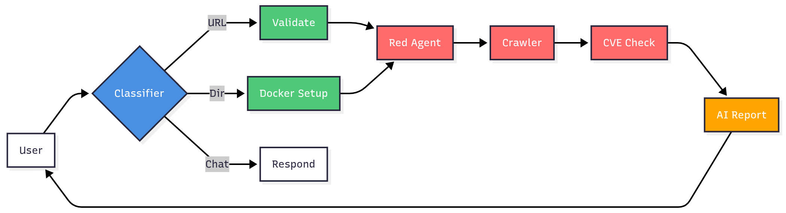

# VulnOdin: Fully Autonomous AI Red Teaming Service

VulnOdin is an experimental, modular red-teaming platform that automates reconnaissance, vulnerability discovery, CVE checking, code analysis, and exploit workflow orchestration using AI agents and LangChain.

This project was built for the AI Safety Hackathon and is intended for research and education. Use responsibly and only on targets you are authorized to assess.

## Highlights

- Autonomous agent orchestrations with LangChain/LangGraph
- Web crawling and content extraction for reconnaissance
- Code analyzer for basic static checks
- CVE checker to match known vulnerabilities
- FastAPI server for programmatic control
- Config-driven payloads and scanning workflows

## Project Structure

```
VulnOdin/
	api_server.py            # FastAPI server exposing endpoints
	config.json              # Global configuration (targets, model settings, etc.)
	main.py                  # CLI entrypoint to run scans/workflows
	requirements.txt         # Python dependencies
	scanning_workflows.py    # Orchestrated scanning pipelines
	tools.py                 # Reusable actions/tools used by agents

	code_analyzer/
		analyzer.py            # Code analyzer utilities

	crawler/
		advanced_crawler.py    # Crawler core
		advanced_crawler_tool.py # Tool wrapper for crawler

	CVE_checker/
		checker.py             # CVE matching utility

	red_agent/
		agent.py               # Main AI agent logic
		agent_tools.py         # Agent tools
		config.json            # Agent-specific configuration

	templates/
		index.html             # Basic UI template (optional)
```

## Requirements

See `requirements.txt` for the full list. Key libraries:

- FastAPI + Uvicorn for the API server
- Pydantic for data models and validation
- Requests + BeautifulSoup for crawling/extraction
- LangChain Core, Classic, Community, and LangGraph for AI orchestration
- PyYAML for YAML parsing

## Setup

1) Create and activate a virtual environment

```bash
python3 -m venv .venv
source .venv/bin/activate
```

2) Install dependencies

```bash
pip install -r requirements.txt
```

3) Optional: set environment variables for any API keys (e.g., LLM providers) used by LangChain tools.

## Configuration

- `VulnOdin/config.json`: global settings like targets, model parameters, and feature toggles.
- `VulnOdin/red_agent/config.json`: agent-specific settings.

Adjust these files to match your target environment and desired behaviors.

## Running

### Start the API server

```bash
uvicorn api_server:app --host 0.0.0.0 --port 8000
```

Then visit `index.html` for interactive security chatbot.

## Screenshots

Below are two flowcharts that illustrate the system at different abstraction levels:

- Flowchart 1 (abstract):

	

- Flowchart 2 (descriptive):

	


## FastAPI Endpoints (overview)

- `GET /health` – health check
- `POST /scan` – trigger a scan workflow
- `GET /results/{id}` – retrieve results

Exact routes depend on your `api_server.py` implementation.

## Security and Ethics

- Only scan systems you own or have explicit permission to test.
- Respect robots.txt and rate limits when crawling.
- Store and handle any found secrets responsibly.

## Troubleshooting

- If imports fail, ensure your venv is active and `pip install -r requirements.txt` ran successfully.
- For `uvicorn` errors, confirm the `api_server:app` import path matches your file layout.
- LangChain models may require provider-specific env vars (e.g., `OPENAI_API_KEY`).
